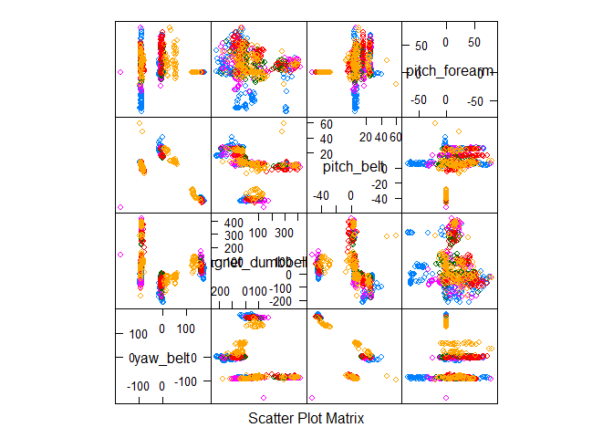

Background
----------

Using devices such as Jawbone Up, Nike FuelBand, and Fitbit it is now
possible to collect a large amount of data about personal activity
relatively inexpensively. These type of devices are part of the
quantified self movement - a group of enthusiasts who take measurements
about themselves regularly to improve their health, to find patterns in
their behavior, or because they are tech geeks. One thing that people
regularly do is quantify how much of a particular activity they do, but
they rarely quantify how well they do it. In this project, your goal
will be to use data from accelerometers on the belt, forearm, arm, and
dumbell of 6 participants. They were asked to perform barbell lifts
correctly and incorrectly in 5 different ways. More information is
available from the website here:
<http://groupware.les.inf.puc-rio.br/har> (see the section on the Weight
Lifting Exercise Dataset).

Data
----

The training data for this project are available here:

<https://d396qusza40orc.cloudfront.net/predmachlearn/pml-training.csv>

The test data are available here:

<https://d396qusza40orc.cloudfront.net/predmachlearn/pml-testing.csv>

The data for this project come from this source:
<http://groupware.les.inf.puc-rio.br/har>. If you use the document you
create for this class for any purpose please cite them as they have been
very generous in allowing their data to be used for this kind of
assignment.

Loading Data
------------

Loading the required machine learning library:

    library(caret)

    ## Loading required package: lattice

    ## Loading required package: ggplot2

    ## 
    ## Attaching package: 'caret'

    ## The following object is masked _by_ '.GlobalEnv':
    ## 
    ##     best

    library(randomForest)

    ## randomForest 4.6-12

    ## Type rfNews() to see new features/changes/bug fixes.

    library(e1071)

The training and testing data are loaded from given link as:

    if (!file.exists("./data/pml-training.csv")) {
      download.file("https://d396qusza40orc.cloudfront.net/predmachlearn/pml-training.csv", destfile = "./data/pml-training.csv")
    }
    if (!file.exists("./data/pml-testing.csv")) {
      download.file("https://d396qusza40orc.cloudfront.net/predmachlearn/pml-testing.csv", destfile = "./data/pml-testing.csv")
    }
    testing <- read.csv("./data/pml-testing.csv", sep = ",", na.strings = c("", "NA"))
    training <- read.csv("./data/pml-training.csv", sep = ",", na.strings = c("", "NA"))

    dim(testing)

    ## [1]  20 160

    dim(training)

    ## [1] 19622   160

Cleaning Data
-------------

Keeping just column of interest only from column 8 to 59 as :

    # Remove columns full of NAs and first 7 features (column) as they are time-series from testing 
    features <- names(testing[,colSums(is.na(testing)) == 0])[8:59]
    # Only use features used in test cases.
    training <- training[,c(features,"classe")]
    testing <- testing[,c(features,"problem_id")]

    dim(testing)

    ## [1] 20 53

    dim(training)

    ## [1] 19622    53

Partitioning Training Data
--------------------------

Partitioning Training data into 75% training data and 25% testing data
for testing after model is constructed.

    #### seed for reproducibility
    set.seed(1024)
    into_Train = createDataPartition(training$classe, p = 0.75, list = F)
    sub_training = training[into_Train,]
    sub_testing = training[-into_Train,]

    dim(sub_training)

    ## [1] 14718    53

    dim(sub_testing)

    ## [1] 4904   53

Feature Selection
-----------------

Feature that are highly correlated about (\>90%) are dropped.

    outcome = which(names(sub_training) == "classe")
    highCorrCols = findCorrelation(abs(cor(sub_training[,-outcome])),0.90)
    sub_training = sub_training[,-highCorrCols]
    outcome = which(names(sub_training) == "classe")

The highly correlated features are :

    highly_Correlated_Features = names(sub_training)[highCorrCols]
    highly_Correlated_Features

    ## [1] "roll_arm"          "pitch_belt"        "magnet_belt_z"    
    ## [4] "magnet_belt_y"     "magnet_dumbbell_y" "roll_forearm"     
    ## [7] "accel_arm_z"

    #### the dimension of sub_training after dropping these features
    dim(sub_training)

    ## [1] 14718    46

Feature Importance using Random Forest
--------------------------------------

Discovering important features using Random Forest as random forest
method reduces overfitting and is good for nonlinear features. The
important 4 features are plotted

    fsRF = randomForest(sub_training[,-outcome], sub_training[,outcome], importance = T)
    rfImp = data.frame(fsRF$importance)
    impFeatures = order(-rfImp$MeanDecreaseGini)
    inImp = createDataPartition(sub_training$classe, p = 0.05, list = F)
    featurePlot(sub_training[inImp,impFeatures[1:4]],sub_training$classe[inImp], plot = "pairs")

<!-- -->
The most important features are :

    names(sub_training[inImp,impFeatures[1:4]])

    ## [1] "yaw_belt"          "magnet_dumbbell_z" "pitch_belt"       
    ## [4] "pitch_forearm"

Training
--------

Training by two model i) Random forest ii) k-nearest neighbors

    #### Training by KNN
    ctrlKNN = trainControl(method = "adaptive_cv")
    modelKNN = train(classe ~ ., sub_training, method = "knn", trControl = ctrlKNN)
    resultsKNN = data.frame(modelKNN$results)
    #### publishing accuracy of KNN
    resultsKNN

    ##   k  Accuracy     Kappa  AccuracySD     KappaSD .B
    ## 1 5 0.9062383 0.8813803 0.007638965 0.009645629 10
    ## 2 7 0.8840727 0.8532752 0.006251121 0.007876520  5
    ## 3 9 0.8692593 0.8344912 0.004939305 0.006147291  5

    #### Training By Random Forest
    ctrlRF = trainControl(method = "oob")
    modelRF = train(classe ~ ., sub_training, method = "rf", ntree = 200, trControl = ctrlRF)
    resultsRF = data.frame(modelRF$results)
    #### publishing accuracy of Random Forest
    resultsRF

    ##    Accuracy     Kappa mtry
    ## 1 0.9925262 0.9905453    2
    ## 2 0.9933415 0.9915772   23
    ## 3 0.9908955 0.9884833   45

It seems that random forest give a larger accuracy compared to k-nearest
neighbors

Testing Out-of-sample error
---------------------------

Looking at confusion matrix between the KNN and RF models to see how
much they agree on the test set, and then I compare each model using the
test set outcomes.

    #### fitting KNN models on sub_testing
    fitKNN = predict(modelKNN, sub_testing)
    #### fitting Random Forest models on sub_testing
    fitRF <- predict(modelRF, sub_testing)

### Comparision of Models using confusionMatrix

RandomForest Versues Test Set

    confusionMatrix(fitRF,sub_testing$classe)

    ## Confusion Matrix and Statistics
    ## 
    ##           Reference
    ## Prediction    A    B    C    D    E
    ##          A 1392    2    0    0    0
    ##          B    3  944    5    0    0
    ##          C    0    3  850   16    0
    ##          D    0    0    0  787    0
    ##          E    0    0    0    1  901
    ## 
    ## Overall Statistics
    ##                                           
    ##                Accuracy : 0.9939          
    ##                  95% CI : (0.9913, 0.9959)
    ##     No Information Rate : 0.2845          
    ##     P-Value [Acc > NIR] : < 2.2e-16       
    ##                                           
    ##                   Kappa : 0.9923          
    ##  Mcnemar's Test P-Value : NA              
    ## 
    ## Statistics by Class:
    ## 
    ##                      Class: A Class: B Class: C Class: D Class: E
    ## Sensitivity            0.9978   0.9947   0.9942   0.9789   1.0000
    ## Specificity            0.9994   0.9980   0.9953   1.0000   0.9998
    ## Pos Pred Value         0.9986   0.9916   0.9781   1.0000   0.9989
    ## Neg Pred Value         0.9991   0.9987   0.9988   0.9959   1.0000
    ## Prevalence             0.2845   0.1935   0.1743   0.1639   0.1837
    ## Detection Rate         0.2838   0.1925   0.1733   0.1605   0.1837
    ## Detection Prevalence   0.2843   0.1941   0.1772   0.1605   0.1839
    ## Balanced Accuracy      0.9986   0.9964   0.9947   0.9894   0.9999

KNN Versues Test Set

    confusionMatrix(fitKNN,sub_testing$classe)

    ## Confusion Matrix and Statistics
    ## 
    ##           Reference
    ## Prediction    A    B    C    D    E
    ##          A 1336   40   16    9    9
    ##          B   18  847   17    4   38
    ##          C   16   27  788   51   30
    ##          D   22   17   19  729   28
    ##          E    3   18   15   11  796
    ## 
    ## Overall Statistics
    ##                                           
    ##                Accuracy : 0.9168          
    ##                  95% CI : (0.9087, 0.9244)
    ##     No Information Rate : 0.2845          
    ##     P-Value [Acc > NIR] : < 2.2e-16       
    ##                                           
    ##                   Kappa : 0.8948          
    ##  Mcnemar's Test P-Value : 2.057e-09       
    ## 
    ## Statistics by Class:
    ## 
    ##                      Class: A Class: B Class: C Class: D Class: E
    ## Sensitivity            0.9577   0.8925   0.9216   0.9067   0.8835
    ## Specificity            0.9789   0.9805   0.9694   0.9790   0.9883
    ## Pos Pred Value         0.9475   0.9167   0.8640   0.8945   0.9442
    ## Neg Pred Value         0.9831   0.9744   0.9832   0.9817   0.9741
    ## Prevalence             0.2845   0.1935   0.1743   0.1639   0.1837
    ## Detection Rate         0.2724   0.1727   0.1607   0.1487   0.1623
    ## Detection Prevalence   0.2875   0.1884   0.1860   0.1662   0.1719
    ## Balanced Accuracy      0.9683   0.9365   0.9455   0.9429   0.9359

RandomForest Versus KNN

    confusionMatrix(fitRF,fitKNN)

    ## Confusion Matrix and Statistics
    ## 
    ##           Reference
    ## Prediction    A    B    C    D    E
    ##          A 1338   17   16   20    3
    ##          B   38  847   29   19   19
    ##          C   17   20  796   22   14
    ##          D    8    2   41  726   10
    ##          E    9   38   30   28  797
    ## 
    ## Overall Statistics
    ##                                           
    ##                Accuracy : 0.9184          
    ##                  95% CI : (0.9104, 0.9259)
    ##     No Information Rate : 0.2875          
    ##     P-Value [Acc > NIR] : < 2.2e-16       
    ##                                           
    ##                   Kappa : 0.8968          
    ##  Mcnemar's Test P-Value : 8.591e-09       
    ## 
    ## Statistics by Class:
    ## 
    ##                      Class: A Class: B Class: C Class: D Class: E
    ## Sensitivity            0.9489   0.9167   0.8728   0.8908   0.9454
    ## Specificity            0.9840   0.9736   0.9817   0.9851   0.9741
    ## Pos Pred Value         0.9598   0.8897   0.9160   0.9225   0.8836
    ## Neg Pred Value         0.9795   0.9805   0.9713   0.9784   0.9885
    ## Prevalence             0.2875   0.1884   0.1860   0.1662   0.1719
    ## Detection Rate         0.2728   0.1727   0.1623   0.1480   0.1625
    ## Detection Prevalence   0.2843   0.1941   0.1772   0.1605   0.1839
    ## Balanced Accuracy      0.9665   0.9451   0.9273   0.9379   0.9598

The random forest fit is clearly more accurate than the k-nearest
neighbors method with 99% accuracy as shown in above.

### Submission

Predicting the values for 20 testing data using Random Forest model.

    predict(modelRF, testing)

    ##  [1] B A B A A E D B A A B C B A E E A B B B
    ## Levels: A B C D E
